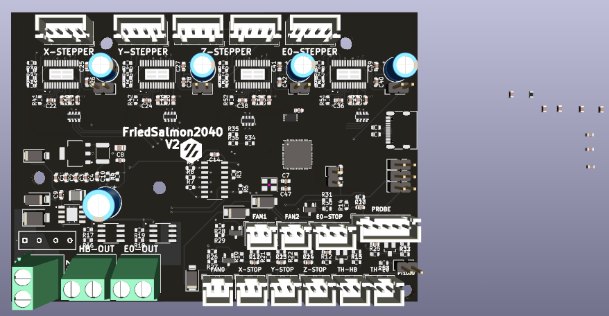

# FriedSalmon 2040
 A RP2040 based 3D Printer Control Board with 4 Integrated TMC2226 Stepper Drivers, PT1000 Support, 3 PWM Fans, 15A Total Bed/E0 Heater Capability, and 6 Pins with access to 5V, 3.3V, GND, and GPIOs 25, 26, and 27.

## [iBOM](https://htmlpreview.github.io/?https://github.com/Fisheiyy/FriedSalmon-2040/blob/main/ibom.html), [BOM](https://docs.google.com/spreadsheets/d/18_6saM__RWSnnuOeO-IjOmcjcUNBl_MXiw4yVhhykyQ/edit#gid=1487594272), [Schematic](https://github.com/Fisheiyy/FriedSalmon-2040/blob/main/rp2040-board.pdf)

## Inspired by the BigTreeTech SKR Mini E3 line of 3D Printer Motherboards
## Made for the Voron and Klipper Communities

# LICENSE
 ### **You CANNOT use anything in this repo for Commercial Use without EXPLICIT PERMISSION**
 #### You can contact me if you have any questions regarding this.
 ## This repository is under the [CC-BY-NC-SA-4.0](https://creativecommons.org/licenses/by-nc-sa/4.0) which states:
 ### You are free to:
   - Share — copy and redistribute the material in any medium or format
   - Adapt — remix, transform, and build upon the material

 ### Under the following terms:
  - Attribution — You **must** give **appropriate credit**, **provide a link to the license**, and **indicate if changes were made**. You may do so in any reasonable manner, but not in     any way that suggests the licensor endorses you or your use.
  - NonCommercial — You may **not** use the material for **commercial purposes.**
  - ShareAlike — If you remix, transform, or build upon the material, you **must distribute your contributions under the same license as the original.**

# PICTURES
 ## V2 Development Picture
 